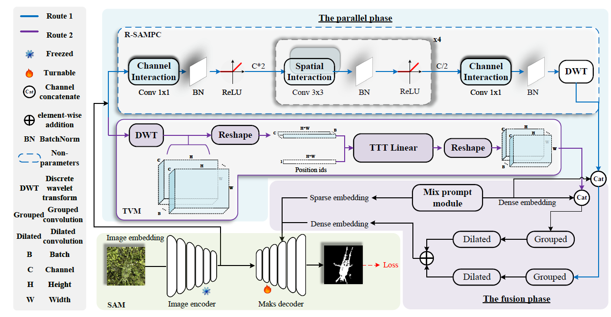
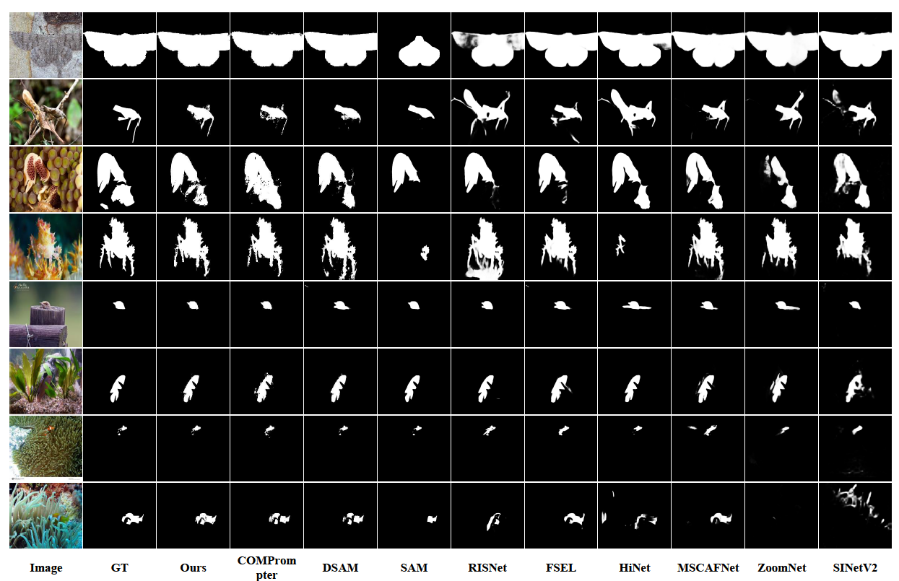
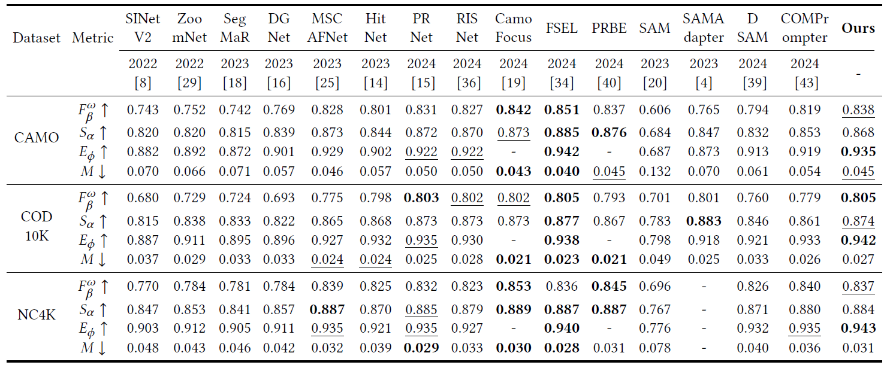

<div align="center">
<h2>SAM-TTT: Segment Anything Model via Reverse Parameter Configuration and Test-Time Training for Camouflaged Object Detection
</h2>
Zhenni Yu, Li Zhao, Guobao Xiao*, Xiaoqin Zhang*
ACM MM, 2025
</div>


## SAM-TTT Overview
<p align="center">
     <br/>
    <em> 
    Overview of our SAM-TTT framework: the Reverse SAM Parameter Configuration Module (R-SAMPC) and the T-vision Module
(TVM). In the parallel phase, R-SAMPC and TVM operate independently, while in the fusion phase, the effectiveness of both modules is
integrated.
    </em>
</p>

## Experiment Results

<p align="center">
     <br/>
    <em>
    Qualitative results.
    </em>
</p>


<p align="center">
     <br/>
    <em> 
    Quantitative results.
    </em>
</p>


### Weights
- **SAM-TTT**:
https://drive.google.com/file/d/1FffLFfBre1PXXU19NO97JfXR5k9Fxs70/view?usp=drive_link

### The predicted image
- **SAM-TTT**: 
https://drive.google.com/file/d/110032Gh0VSUSfl5d2W2oaHVa9HB1OuVq/view?usp=drive_link

## Experiment Setting

The YML file is for reference only. There are redundant environments and not all of them need to be installed.

## dataset
Refer to [[COMPrompter](https://github.com/guobaoxiao/COMPrompter)]


## Training
For the training process, run:

    python My_Train.py

## Testing / Inference

And run:

    python Inference.py


## Citation

If you find this project useful, please consider citing:

```bibtex
@inproceedings{Zhenni Yu, Li Zhao, Guobao Xiao, Xiaoqin Zhang. 
SAM-TTT: Segment Anything Model via Reverse Parameter Configuration and Test-Time Training for Camouflaged Object Detection [C]. 
ACM International Conference on Multimedia, 2025}
}
```